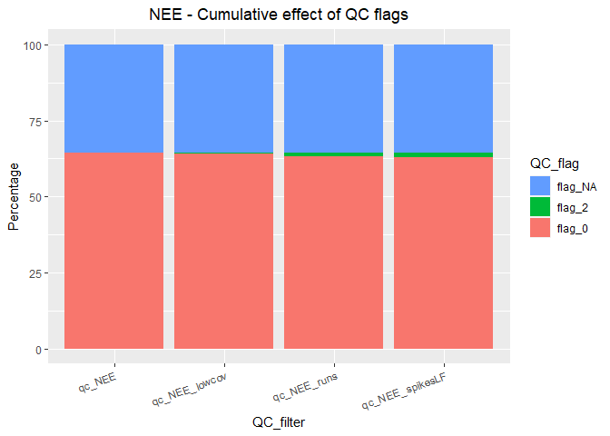
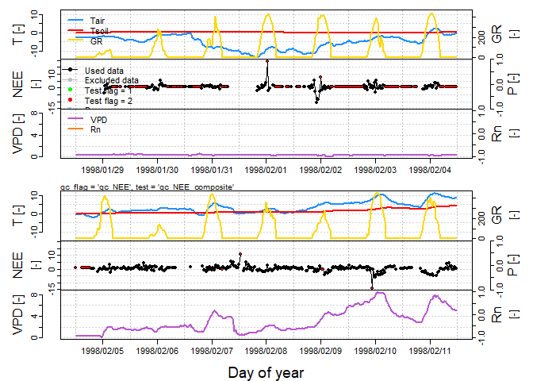
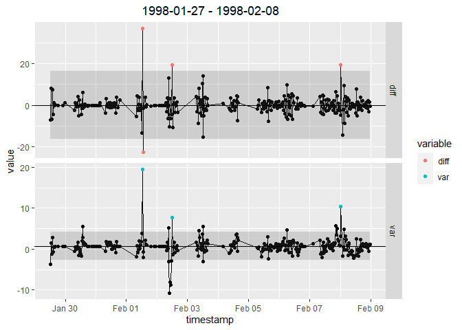

<!-- README.md is generated from README.Rmd. Please edit that file -->

# openeddy

## Overview

The `openeddy` package is a software infrastructure for eddy covariance
data post-processing. It provides tools for handling data with attached
metadata, setting up quality control scheme and summarizing and plotting
the results. It is aligned with
[REddyProc](https://github.com/bgctw/REddyProc) package that provides
methods for uStar-filtering, gap-filling, and flux-partitioning. Thus
the combined use of `openeddy` and `REddyProc` allows to run the whole
eddy covariance post-processing chain. Learn more at
<https://github.com/lsigut/EC_workflow>.

## Installation

1.  Install devtools package if not available yet.

    ``` r
    install.packages("devtools")
    ```

2.  Install openeddy

    ``` r
    devtools::install_github("lsigut/openeddy")
    ```

## Extended Example

An extended example of applied `openeddy` software infrastructure is
available at:

<https://github.com/lsigut/EC_workflow>

## Short Example

Demonstration of selected generally applicable `openeddy` functions.

``` r
library(openeddy)
#> 
#> Attaching package: 'openeddy'
#> The following objects are masked from 'package:base':
#> 
#>     units, units<-
library(REddyProc)
library(ggplot2)
```

Example data from `REddyProc` package do not include statistics
extracted from raw data or quality control (QC) flags. Notice that units
are included.

``` r
data(Example_DETha98)
str(Example_DETha98[1:4])
#> 'data.frame':    17520 obs. of  4 variables:
#>  $ Year: int  1998 1998 1998 1998 1998 1998 1998 1998 1998 1998 ...
#>   ..- attr(*, "varnames")= chr "Year"
#>   ..- attr(*, "units")= chr "-"
#>  $ DoY : int  1 1 1 1 1 1 1 1 1 1 ...
#>   ..- attr(*, "varnames")= chr "DoY"
#>   ..- attr(*, "units")= chr "-"
#>  $ Hour: num  0.5 1 1.5 2 2.5 3 3.5 4 4.5 5 ...
#>   ..- attr(*, "varnames")= chr "Hour"
#>   ..- attr(*, "units")= chr "-"
#>  $ NEE : num  -1.21 1.72 NA NA 2.55 NA NA NA 4.11 NA ...
#>   ..- attr(*, "varnames")= chr "NEE"
#>   ..- attr(*, "units")= chr "umolm-2s-1"
DETha98 <- fConvertTimeToPosix(Example_DETha98, 'YDH', 
                               Year = 'Year', Day = 'DoY', Hour = 'Hour')
#> Converted time format 'YDH' to POSIX with column name 'DateTime'.
```

Certain variable names are expected by `openeddy`, thus DETha98 variable
names need to be renamed. Net ecosystem exchange (NEE) is already
filtered based on QC information (qc_NEE) that is not included. Though
flag 2 values can be recreated, respective NEE values are missing and
flag 1 cannot be resolved.

``` r
rename <- names(DETha98) %in% c("DateTime", "Rg")
names(DETha98)[rename] <- c("timestamp", "GR")
DETha98$qc_NEE <- ifelse(is.na(DETha98$NEE), NA, 0)
```

Application of three general filters is presented.

1.  Low covariance between vertical wind component and CO<sub>2</sub>
    concentration ((CO<sub>2</sub>)) can be caused by frozen ultrasonic
    anemometer or problems with (CO<sub>2</sub>) measurements. Such
    cases are flagged and saved to qc_NEE_lowcov.
2.  Runs with repeating values are a sign of malfunctioning equipment
    (qc_NEE_runs).
3.  Spikes in low frequency data cause problems during gap-filling and
    should be excluded. Since DETha98 was already quality checked, the
    amount of detected spikes is limited. In order to correctly evaluate
    spikes, preliminary QC (qc_NEE_prelim) that combines available QC
    tests or filters should be produced and used in `despikeLF`.

``` r
DETha98$qc_NEE_lowcov <- 
  apply_thr(DETha98$NEE, c(-0.01, 0.01), "qc_NEE_lowcov", "between")
summary_QC(DETha98, "qc_NEE_lowcov")
#> no columns with 'na.as = 0' detected
#>                QC_flag
#> QC_filter       flag_0 flag_2 flag_NA
#>   qc_NEE_lowcov   64.2    0.1    35.7
DETha98$qc_NEE_runs <- flag_runs(DETha98$NEE, "qc_NEE_runs")
summary_QC(DETha98, "qc_NEE_runs")
#> no columns with 'na.as = 0' detected
#>              QC_flag
#> QC_filter     flag_0 flag_2 flag_NA
#>   qc_NEE_runs   63.2    1.1    35.7
DETha98$qc_NEE_prelim <- 
  combn_QC(DETha98, 
           c("qc_NEE", "qc_NEE_lowcov", "qc_NEE_runs"), 
           "qc_NEE_prelim")
#> no columns with additive effect detected
#> no columns with 'na.as = 0' detected
DETha98$qc_NEE_spikesLF <- 
  despikeLF(DETha98, "NEE", "qc_NEE_prelim", "qc_NEE_spikesLF", 
            light = NULL)
#> iter 1: 25
#> iter 2: 1
#> iter 3: 0
#> Further iterations omitted
summary_QC(DETha98, "qc_NEE_spikesLF")
#> detected columns with 'na.as = 0': qc_NEE_spikesLF
#>                  QC_flag
#> QC_filter         flag_0 flag_2
#>   qc_NEE_spikesLF   99.9    0.1
```

The QC results can be summarized in tabular or graphical form using
`summary_QC`. It is possible to summarize each filter independently or
summarize the cumulative effect of applied filters. Note that the
fraction of flagged records in this example is negligible as DETha98
data set was already quality checked.

``` r
summary_QC(DETha98, 
           c("qc_NEE", "qc_NEE_lowcov", "qc_NEE_runs", "qc_NEE_spikesLF"))
#> detected columns with 'na.as = 0': qc_NEE_spikesLF
#>                  QC_flag
#> QC_filter         flag_0 flag_2 flag_NA
#>   qc_NEE            64.3    0.0    35.7
#>   qc_NEE_lowcov     64.2    0.1    35.7
#>   qc_NEE_runs       63.2    1.1    35.7
#>   qc_NEE_spikesLF   99.9    0.1     0.0
summary_QC(DETha98, 
           c("qc_NEE", "qc_NEE_lowcov", "qc_NEE_runs", "qc_NEE_spikesLF"),
           cumul = TRUE, plot = TRUE, flux = "NEE")
#> detected columns with 'na.as = 0': qc_NEE_spikesLF
#> no columns with additive effect detected
```



Although individual QC columns should be stored as they are useful to
distinguish the reason why certain records were excluded, only the
combined QC column (qc_NEE_composite) is usually used in further data
processing and analysis.

``` r
DETha98$qc_NEE_composite <- 
  combn_QC(DETha98, 
           c("qc_NEE", "qc_NEE_lowcov", "qc_NEE_runs", "qc_NEE_spikesLF"), 
           "qc_NEE_composite")
#> no columns with additive effect detected
#> detected columns with 'na.as = 0': qc_NEE_spikesLF
```

Function `plot_eddy` is useful for visualization of the whole dataset
including flux values, its respective QC flags and the most important
micrometeorological parameters in monthly and weekly time resolution.
Only a two week subset is presented here to limit the extent of output.

``` r
DETha98[, c("P", "PAR", "Rn")] <- NA
(varnames <- varnames(DETha98))
#>  [1] "DateTime"         "Year"             "DoY"              "Hour"            
#>  [5] "NEE"              "LE"               "H"                "Rg"              
#>  [9] "Tair"             "Tsoil"            "rH"               "VPD"             
#> [13] "Ustar"            "-"                "qc_NEE_lowcov"    "qc_NEE_runs"     
#> [17] "qc_NEE_prelim"    "qc_NEE_spikesLF"  "qc_NEE_composite" "-"               
#> [21] "-"                "-"
(units <- openeddy::units(DETha98))
#>  [1] "POSIXDate Time" "-"              "-"              "-"             
#>  [5] "umolm-2s-1"     "Wm-2"           "Wm-2"           "Wm-2"          
#>  [9] "degC"           "degC"           "%"              "hPa"           
#> [13] "ms-1"           "-"              "-"              "-"             
#> [17] "-"              "-"              "-"              "-"             
#> [21] "-"              "-"
sub <- DETha98$DoY >= 29 & DETha98$DoY < 43
DETha98_sub <- DETha98[sub, ]
openeddy::units(DETha98) <- units
plot_eddy(DETha98_sub, "NEE", "qc_NEE", "qc_NEE_composite", skip = "monthly",
          light = "GR")
```



In addition to actual despiking, `despikeLF` can be used also for
visualization of the internally computed double-differenced time series
in order to inspect selected 13 days blocks. See section Plotting in
`despikeLF` help file for further description.

``` r
despikeLF_plots <- 
  despikeLF(DETha98, "NEE", "qc_NEE_prelim", "qc_NEE_spikesLF", 
            light = NULL, plot = TRUE)$plots
#> iter 1: 25
#> iter 2: 1
#> iter 3: 0
#> Further iterations omitted
despikeLF_plots$`iter 1`$all$`1998-01-27 - 1998-02-08`
```



## References

Publication describing `openeddy` is not yet available. When describing
the proposed quality control scheme, please refer to it as similar to:

McGloin, R., Sigut, L., Havrankova, K., Dusek, J., Pavelka, M., Sedlak,
P., 2018. Energy balance closure at a variety of ecosystems in Central
Europe with contrasting topographies. Agric. For. Meteorol. 248,
418-431. <https://doi.org/10.1016/j.agrformet.2017.10.003>
